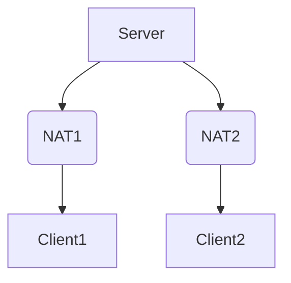
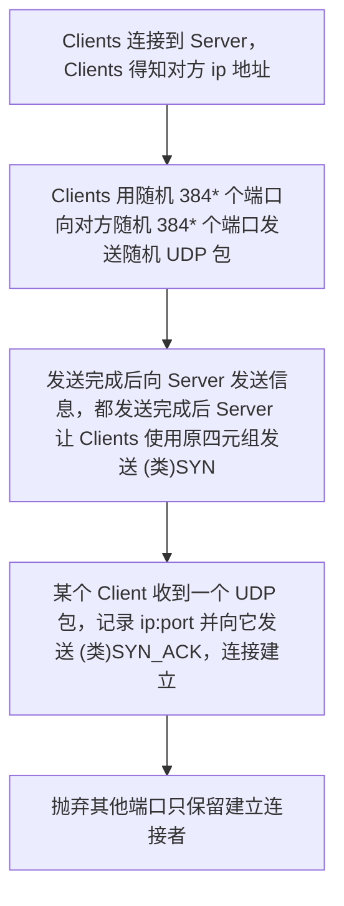
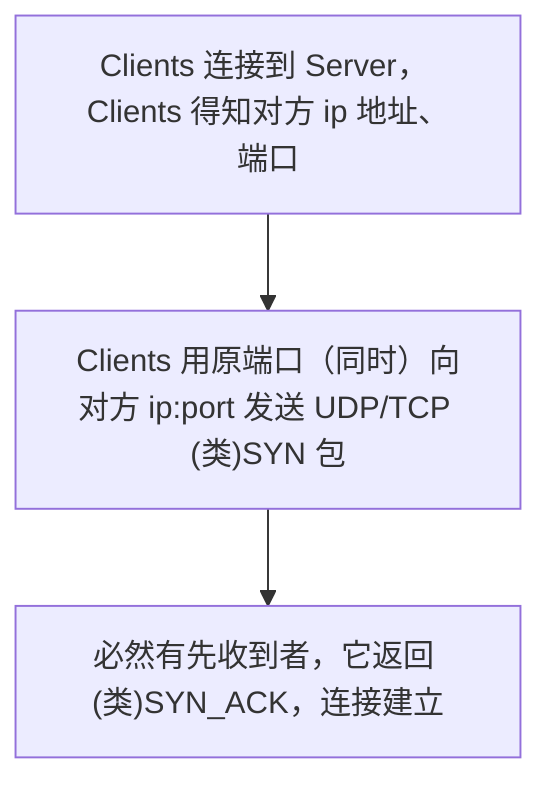

# 穿透对称型 NAT 设备[^1]

（~~一个晚上的思考结果~~）

尝试消耗尽可能少的资源（大约 400 个 内网端口和 NAT 设备的 Map 规则），使用（生日攻击式的）端口探测的方式，穿透 Address and Port-Dependent Mapping 且 Address-Dependent Filtering[^2]（及以下安全等级）的 NAT 设备，且假设 NAT 设备分配的 ip 地址唯一（绝大多数情况都是如此）。

网络结构：

实现方式：

> \* 此时探测成功率达到 $1-{{65536-384}\choose{384}}/{{65536}\choose{384}}\approx89.6\%$[^3]

注：

- 假设：只要 NAT 背后的 Client 向一个 ip:port 发送了数据，Mapping 和 Filtering 就都建立了。
- 有些 NAT 设备有 NAT 分配端口段，提前了解这些规律可以缩减随机端口的范围，以减少占用的端口达到相近的探测成功率。
- 有些 NAT 设备对单内网 ip 的端口分配数有限制（据说电信 2000，联通 1000，移动 500），注意别超过了。
- 若双方都是 Address and Port-Dependent Filtering Behaviour 则成功概率降低到 $\frac{384}{65536^2}\approx10^{-7}$，几乎不可能。只能进行一些端口预测（这在 NAT 设备已分配端口数较多时几乎不可行）。不幸的是，这是更普遍的情况，在 NAT设备的公网 ip 资源极其稀缺或企业 NAT 的情况下都会出现。在这种内网，可以试试社会工程，跟领导或电信局说：我要 NAT ！
- 若一方是 Address and Port-Dependent Filtering Behaviour，一方是 Address-Dependent Filtering 及以下，理论上也可以运行。
- 有的设备甚至在 RFC 标准之上添加了 Protocol Mapping 和 Filtering。对于 UDP 的穿透无影响，但对 TCP 就可能需要一些伪造的 ACK 包（如果那些设备需要 ACK 包建立合法映射）。（猜测，无依据）

附：Mapping Behaviour 为 Endpoint Independent （任何 Filtering Behaviour）时的最简穿透方式：

参考文献：

[^1]:https://arthurchiao.art/blog/how-nat-traversal-works-zh/
[^2]:https://www.rfc-editor.org/rfc/rfc4787#section-5
[^3]:https://www.wolframalpha.com/input?i=1-N%5BC%5B65536-x%2Cx%5D%5D%2FN%5BC%5B65536%2Cx%5D%5D%2C+x%3D384

